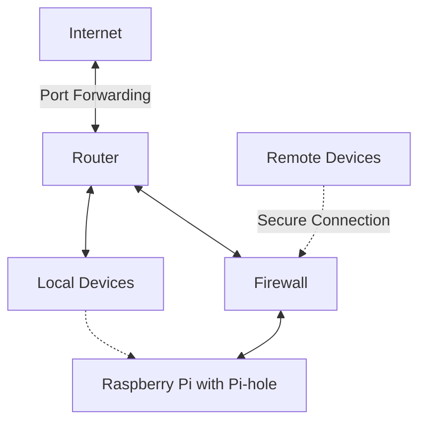

# Pi-hole Network Setup

This project implements a Pi-hole ad-blocking DNS server on a Raspberry Pi, securely exposed via router for trusted remote users. It includes strict firewall rules for enhanced security.

## Project Overview

<table>
<tr>
<td width="50%">

</td>
<td width="500%">

</td>
</tr>
</table>

## Features

- Ad-blocking DNS server using Pi-hole
- Remote access for trusted users
- Firewall protection for enhanced security
- Raspberry Pi based setup

## Setup

[...]

## Usage

[...]
