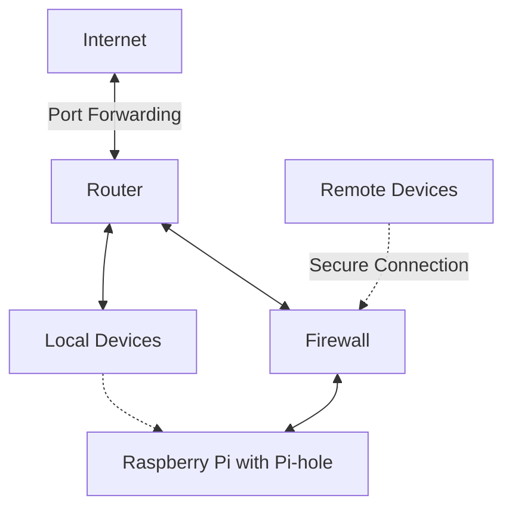

# Pi-hole Network Setup

This project implements a Pi-hole ad-blocking DNS server on a Raspberry Pi, securely exposed via router for trusted remote users. It includes strict firewall rules for enhanced security.

## Network Diagram

## Features

- Ad-blocking DNS server using Pi-hole
- Remote access for trusted users
- Firewall protection for enhanced security
- Raspberry Pi based setup

## Setup

[Add your setup instructions here]

## Usage

[...]

## Security Considerations

[...]

## Contributing

[...]

## License

[...]
